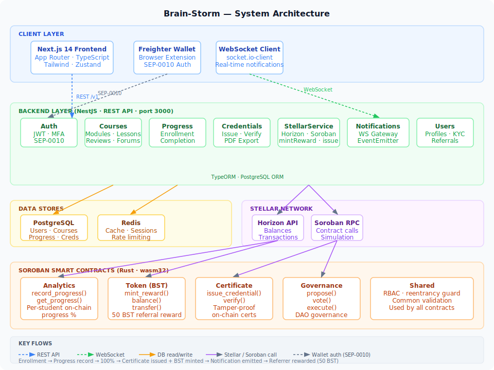

# Architecture

The diagram below shows the full system — all layers, contracts, external services, and the data flow for key operations.



## Layers

### Client
| Component | Role |
|---|---|
| Next.js 14 (App Router) | SSR/SSG frontend, course UI, profile, credentials |
| Freighter Wallet | Browser extension; signs SEP-0010 challenges for wallet auth |
| socket.io-client | Receives real-time notifications over WebSocket |

### Backend (NestJS, port 3000)
| Module | Responsibility |
|---|---|
| Auth | JWT issuance, refresh, MFA, SEP-0010 Stellar auth |
| Courses | Course/module/lesson CRUD, reviews, forums |
| Progress | Enrollment, lesson completion, on-chain progress recording |
| Credentials | Issue & verify tamper-proof certificates; PDF export |
| StellarService | Wraps Horizon + Soroban RPC; `mintReward`, `issueCredential`, `recordProgress` |
| Notifications | REST + WebSocket gateway; emits events on enrollment, completion, credential issuance |
| Users | Profiles, KYC, referral codes |

### Data Stores
| Store | Usage |
|---|---|
| PostgreSQL | All relational data — users, courses, progress, credentials, notifications |
| Redis | Response cache, session data, rate-limit counters |

### Stellar Network
| Service | Usage |
|---|---|
| Horizon API | Account balances, transaction submission fallback |
| Soroban RPC | Smart contract invocation and simulation |

### Smart Contracts (Rust / wasm32)
| Contract | Key functions |
|---|---|
| Analytics | `record_progress()`, `get_progress()` — per-student on-chain progress % |
| Token (BST) | `mint_reward()`, `balance()`, `transfer()` — BST reward token |
| Certificate | `issue_credential()`, `verify()` — tamper-proof on-chain certificates |
| Governance | `propose()`, `vote()`, `execute()` — DAO governance |
| Shared | RBAC, reentrancy guard, common validation — imported by all contracts |

## Key Data Flows

### Enrollment
```
User → POST /v1/enrollments → EnrollmentsService → PostgreSQL
                                                  → NotificationsService → WS emit
```

### Progress & Credential Issuance
```
User → POST /v1/progress → ProgressService → StellarService.recordProgress()
                                           → Analytics contract (on-chain %)
                         → [at 100%] CredentialsService.issue()
                                   → StellarService.issueCredential()
                                   → Certificate contract
                         → [at 100%, first course] StellarService.mintReward(referrer, 50)
                                                  → Token contract
                         → NotificationsService.create() → WS emit to user
```

### Token Reward (Referral)
```
Registration with ?ref=CODE → referredBy set on User
First course completion     → Token contract: mint 50 BST to referrer's Stellar address
```

### Real-time Notifications
```
Any service event → NotificationsService.create()
                  → NotificationsGateway.emitToUser()
                  → socket.io room user:<id>
                  → Frontend bell badge increments
```

### Wallet Auth (SEP-0010)
```
Freighter signs challenge XDR → POST /v1/auth/stellar
                              → StellarAuthService.verifyChallenge()
                              → JWT issued
```
